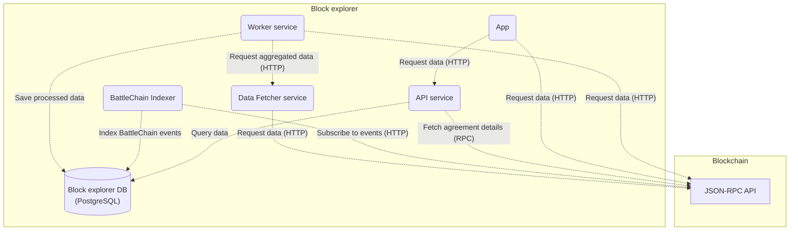

<h1 align="center">BattleChain Block Explorer</h1>

<p align="center">Block explorer for the BattleChain network, forked from the <a href="https://github.com/matter-labs/block-explorer">ZKsync Block Explorer</a>.</p>

## Overview
This repository is a monorepo consisting of 6 packages:

**Core (from upstream ZKsync Block Explorer):**
- [Worker](./packages/worker) - an indexer service for blockchain data. Reads blockchain data in real time, transforms it and fills its database in a way that makes it easy to be queried by the [API](./packages/api) service.
- [Data Fetcher](./packages/data-fetcher) - a service that exposes an HTTP endpoint to retrieve aggregated data for a certain block / range of blocks from the blockchain. Called by the [Worker](./packages/worker) service.
- [API](./packages/api) - a service providing Web API for retrieving structured blockchain data collected by [Worker](./packages/worker). Also serves the [BattleChain API](#battlechain-api) endpoints.
- [App](./packages/app) - a front-end app providing an easy-to-use interface for users to view and inspect transactions, blocks, contracts and more. Includes a [Safe Harbor Agreements](#safe-harbor-agreements) page.

**BattleChain-specific:**
- [BattleChain Deployer](./packages/battlechain-deployer) - deploys BattleChain smart contracts (AttackRegistry, AgreementFactory, SafeHarborRegistry) to the local chain and outputs deployed addresses to a shared volume.
- [BattleChain Indexer](./packages/battlechain-indexer) - indexes BattleChain contract events using [rindexer](https://github.com/joshstevens19/rindexer). Populates the `battlechain` schema in the shared PostgreSQL database.

## Architecture


The [Worker](./packages/worker) and [Data Fetcher](./packages/data-fetcher) handle general blockchain indexing (transactions, blocks, tokens, etc.). The [BattleChain Indexer](./packages/battlechain-indexer) indexes BattleChain-specific contract events (agreement creation, state changes, scope updates) into the `battlechain` schema. The [API](./packages/api) serves both the standard block explorer endpoints and BattleChain-specific endpoints, including proactive RPC polling to fetch on-chain agreement details.

## BattleChain API
The API exposes BattleChain endpoints under `/battlechain/*`:

| Endpoint | Description |
|----------|-------------|
| `GET /battlechain/contract-state/:address` | Get the current AttackRegistry state for a contract |
| `GET /battlechain/agreement/:address` | Get agreement details by agreement address |
| `GET /battlechain/agreement/by-contract/:address` | Find the agreement covering a specific contract |
| `GET /battlechain/agreements` | List all agreements (paginated, sortable, filterable by state) |
| `GET /battlechain/authorized-owner/:address` | Check if a contract was deployed via BattleChainDeployer |
| `POST /battlechain/authorized-owners` | Batch check authorized owners for multiple contracts |
| `GET /battlechain/attack-moderator/:address` | Get the current attack moderator for an agreement |

Agreement details (protocol name, bounty terms, contact info) are fetched from the chain via RPC and cached in the database. A polling job proactively fetches details for newly indexed agreements within ~10 seconds of creation.

## Safe Harbor Agreements
The front-end App includes a Safe Harbor Agreements page (`/agreements`) that displays all agreements created via the AgreementFactory contract. Agreements that haven't had their on-chain details fetched yet show loading placeholders that resolve once the polling job completes.

## Prerequisites

- `node >= 18.0.0` and `npm >= 9.0.0`
- Docker and Docker Compose (for running the full stack)

## Running in Docker
The recommended way to run the full stack locally:
```bash
docker compose up
```
This starts: local Ethereum node (reth), ZKsync, PostgreSQL, BattleChain Deployer, BattleChain Indexer, Worker, Data Fetcher, API, and App.

To also deploy a test agreement on startup:
```bash
CREATE_TEST_AGREEMENT=true docker compose up
```

To seed BattleChain development data:
```bash
SEED_BATTLECHAIN_DATA=true docker compose up
```

### Rebuilding after code changes
If you've made changes to the API or indexer code, rebuild the affected images:
```bash
docker compose up -d --build api battlechain-indexer
```

If you've changed the database schema, do a full volume reset:
```bash
docker compose down -v
docker compose up
```

## Running locally (without Docker)

Make sure you have a PostgreSQL database server running and all environment variables configured. See individual package READMEs for env variable details:
- [Worker](./packages/worker#setting-up-env-variables)
- [Data Fetcher](./packages/data-fetcher#setting-up-env-variables)
- [API](./packages/api#setting-up-env-variables)
- [App](./packages/app#environment-configs)

```bash
npm install
npm run db:create
npm run dev
```

## Verify services are running

| Service | URL |
|---------|-----|
| App | http://localhost:3010 |
| API | http://localhost:3020 |
| API Swagger Docs | http://localhost:3020/docs |
| Worker | http://localhost:3001 |
| Data Fetcher | http://localhost:3040 |

## Testing
Run unit tests for all packages:
```bash
npm run test
```

Run the BattleChain smoke test (requires Docker stack running):
```bash
./scripts/smoke-test-battlechain.sh
```

Run tests for a specific package:
```bash
npm run test -w {package}
```

## Environment Variables (BattleChain-specific)

| Variable | Service | Description |
|----------|---------|-------------|
| `BATTLECHAIN_RPC_URL` | API | RPC URL for fetching on-chain agreement details (falls back to `BLOCKCHAIN_RPC_URL` if not set) |
| `DEPLOYER_PRIVATE_KEY` | Deployer | Private key for deploying BattleChain contracts (local dev only; defaults to the ZKsync rich wallet key) |
| `SEED_BATTLECHAIN_DATA` | Deployer | Set to `true` to seed dev data on startup |
| `CREATE_TEST_AGREEMENT` | Deployer | Set to `true` to create a test agreement on startup |
| `ATTACK_REGISTRY_ADDRESS` | Indexer | Manual override for AttackRegistry address |
| `AGREEMENT_FACTORY_ADDRESS` | Indexer | Manual override for AgreementFactory address |
| `SAFE_HARBOR_REGISTRY_ADDRESS` | Indexer | Manual override for SafeHarborRegistry address |
| `BATTLECHAIN_START_BLOCK` | Indexer | Block number to start indexing from |

## License
Distributed under the terms of either:

- Apache License, Version 2.0 ([LICENSE-APACHE](LICENSE-APACHE) or <http://www.apache.org/licenses/LICENSE-2.0>)
- MIT license ([LICENSE-MIT](LICENSE-MIT) or <http://opensource.org/licenses/MIT>)

at your option.
